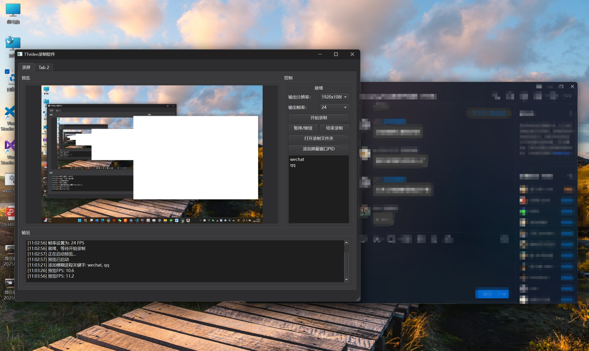

# TTvideo - 免费开源PC录屏软件

TTvideo 是一款针对PC平台开发的**免费开源录屏工具**，支持Intel、NVIDIA、AMD硬件加速编码，主打「智能窗口屏蔽」功能，可通过进程名称关键字自动模糊指定程序窗口，适用于教学录制、游戏直播等需要隐私保护的场景。

---

## 核心特性

### 🔒 智能窗口屏蔽
- **进程名称匹配**：通过输入目标程序名称关键字（如`wechat`、`qq`），自动识别并模糊对应窗口区域（当前默认替换为全白色遮罩）。
- **实时预览**：屏蔽效果在录制前即可通过预览窗口实时查看，确保屏蔽范围准确。

### 🚀 多硬件加速支持
- **硬件编码优化**：自动检测NVIDIA（NVENC）、AMD（AMF）、Intel（QSV）硬件编码器，优先使用硬件加速提升录制效率，降低CPU占用。
- **软件编码兜底**：无硬件编码器时自动降级为x264/MP4V软件编码，兼容老旧设备。

### 🎥 专业录屏功能
- **多分辨率/帧率支持**：提供1920x1080、1280x720等常用分辨率选项，支持15/24/30FPS灵活设置。
- **暂停/继续录制**：录制过程中可随时暂停，恢复后自动续录，避免重复操作。
- **实时性能监控**：界面实时显示录制FPS、已录帧数、文件大小等关键指标。

---

## 支持平台
- **操作系统**：Windows（主开发平台，Linux/macOS需自行适配依赖）
- **硬件要求**：支持Intel/AMD/NVIDIA显卡（推荐支持硬件编码的中高端显卡以获得最佳体验）

---

## 安装与运行

### 前置依赖
- Python 3.10+
- 依赖库安装（需管理员权限）：
  ```bash
  pip install pyqt6 dxcam psutil pyautogui opencv-python win32gui GPUtil
  ```

### 运行截图





